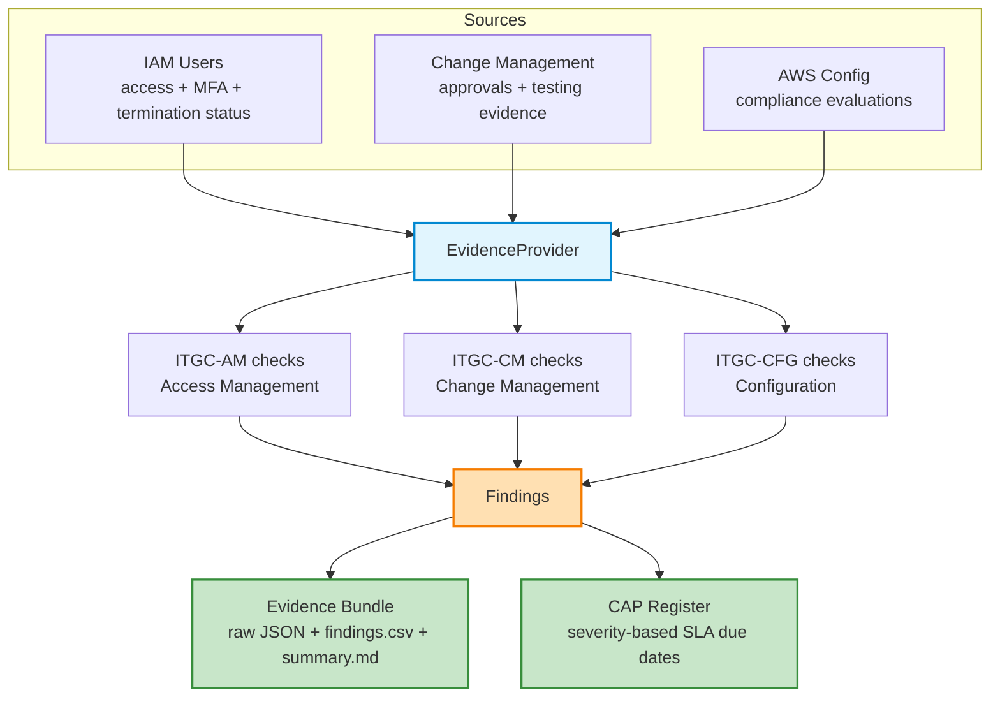

# 🗂️ SOX ITGC Audit Evidence Automation

[](https://www.python.org/)
[](https://aws.amazon.com/)
[](tests/)
[](LICENSE)

Automates the most time-consuming part of a SOX IT General Controls (ITGC) audit cycle:
pulling access management, change management, and configuration compliance evidence,
running it against control objectives, and packaging the result into an audit-ready
evidence bundle with an auto-generated Corrective Action Plan (CAP) register.

## Why this exists

A recurring theme in ITGC audit prep is manually screenshotting IAM consoles, exporting
change tickets, and cross-referencing them against control objectives by hand. This tool
replaces that with a repeatable pipeline: pull evidence → evaluate against control
rules → package for the auditor → auto-generate CAPs for every exception, with an SLA
clock already attached based on severity.

## Architecture



The `EvidenceProvider` interface (`evidence_automation/providers.py`) is pluggable:
- **`MockProvider`** (default, used in this repo) reads synthetic fixtures from
  [`fixtures/`](fixtures/) so the whole pipeline runs with zero credentials.
- **`AWSProvider`** is a real `boto3`-backed implementation (IAM + AWS Config) for
  pointing this at an actual AWS account — wire `get_change_records` to your
  ServiceNow/Jira API to complete it.

## Controls implemented

| Control ID | Area | Objective |
|---|---|---|
| `ITGC-AM-01` | Access Management | MFA enforced for all active accounts |
| `ITGC-AM-02` | Access Management | Access revoked timely after termination |
| `ITGC-AM-03` | Access Management | Privileged access scoped to authorized departments |
| `ITGC-CM-01` | Change Management | All changes have a recorded approval |
| `ITGC-CM-02` | Change Management | Requester and approver are segregated (SoD) |
| `ITGC-CM-03` | Change Management | Changes tested before deployment |
| `ITGC-CFG-01` | Configuration Management | AWS Config rules report compliant resources |

## Quick start

```bash
pip install -r requirements.txt
python cli.py
```

This runs against the synthetic fixtures in `fixtures/` and writes a timestamped bundle
to `evidence_packages/evidence-<timestamp>/` containing:
- `raw_*.json` — the evidence as pulled, for traceability
- `findings.csv` — every control exception
- `cap_register.csv` — auto-generated CAPs with owner + SLA-based due date
- `evidence_summary.md` — auditor-facing narrative and control coverage table

## Sample run

```
Evidence bundle: evidence_packages/evidence-20260728-190232
Findings: 12  |  CAPs generated: 12
  [High  ] ITGC-AM-01  r.patel: MFA is not enforced for all user accounts
  [High  ] ITGC-AM-02  k.obrien: Access was not revoked timely after termination
  [High  ] ITGC-CM-02  CHG-1002: Segregation of duties violation: requester approved their own change
  ...
```

## Project structure

```
itgc-evidence-automation/
├── cli.py
├── evidence_automation/
│   ├── providers.py      # MockProvider (fixtures) + AWSProvider (boto3, IAM/Config)
│   ├── controls.py        # ITGC control check logic -> Finding objects
│   ├── packager.py        # bundles raw evidence + findings into an audit package
│   └── cap_tracker.py     # generates CAPs with severity-based SLA due dates
├── fixtures/               # synthetic IAM / change management / Config data
├── evidence_packages/      # generated output (gitignored)
└── tests/
    └── test_controls.py
```

## Tests

```bash
pip install pytest
python -m pytest tests/ -v
```

## Roadmap

- [ ] ServiceNow Change Request API adapter for `get_change_records`
- [ ] Multi-cycle evidence diffing (show what changed since last quarter's evidence pull)
- [ ] PDF export of `evidence_summary.md` for auditor handoff

## About

Built by [Mihir Ajmera](https://linkedin.com/in/mihirajmera) — GRC Engineer specializing
in SOX ITGC testing, control evidence collection, and audit readiness automation.
